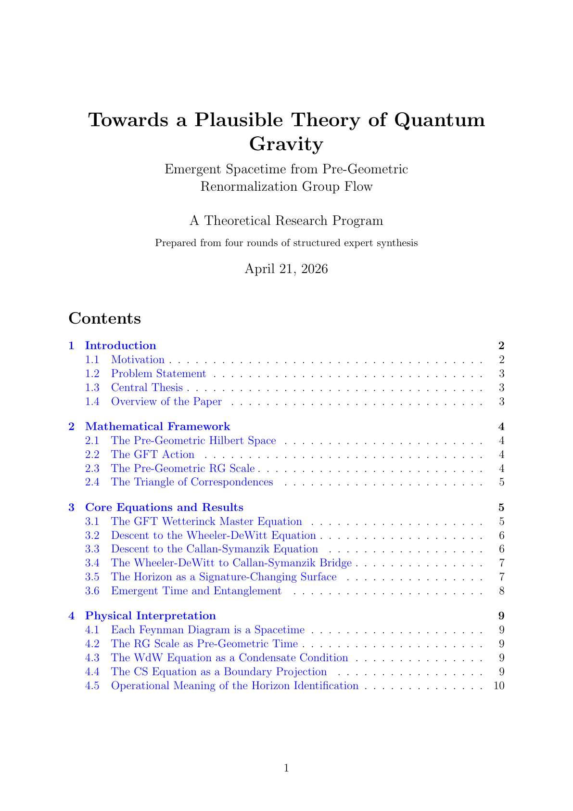
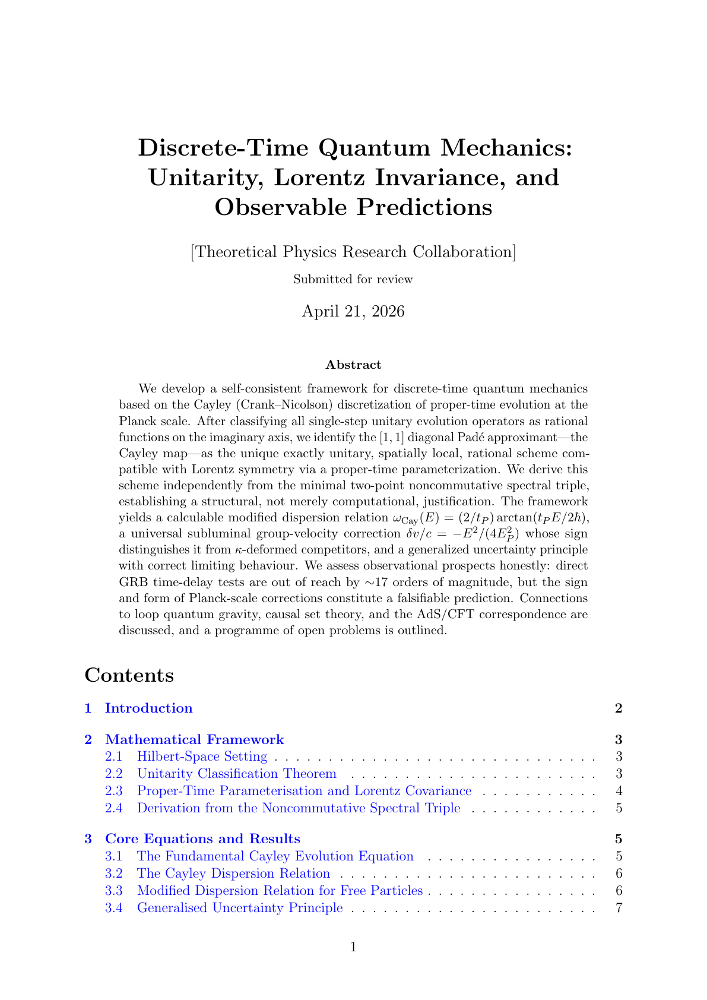

# Universal Physicist

Agent-powered theoretical physicist: describe a topic in one phrase, pull papers, preprocess the library, and run multi-round expert sessions with optional LaTeX output. Choose **researcher** mode (explore new ideas; may use a wild theorist) or **teacher** mode (expository only, pedagogical agent—no speculative new theories as the goal).

### How to run `main.py`

| What you want | Command |
|----------------|---------|
| **One phrase on the command line** | `py -3 main.py --phrase "your topic here"` (optional: `--mode teacher`, `--pdf` / `--no-pdf`, etc.) |
| **Interactive phrase** (prompted after launch) | `py -3 main.py` or `py -3 main.py -i` — this does **not** read `instructions.json`. |
| **Structured brief** (`query`, `keywords`, `authors`, exclusions, …) | `py -3 main.py --use-instructions` — loads **[`instructions.json`](instructions.json)** at the repo root (tracked; default brief for a **new quantum-gravity-style** run). Use **`--instructions path\to\alt.json`** for a private copy without editing the repo file. Details: [Structured instructions](#structured-instructions-json). |
| **No new papers** (skip arXiv / INSPIRE / Semantic Scholar downloads) | Add **`--skip-papers`**. Often add **`--skip-preprocess`** too if you are not refreshing the library. Literature agents then use only whatever is already under `papers/<slug>/`. |

API key and YAML settings: [section 1](#1-anthropic-api-and-configuration).

<!-- Example block: bordered callout (renders on GitHub) -->
<div align="left" style="border: 1px solid #d0d7de; border-radius: 8px; padding: 14px 18px; background-color: #f6f8fa; margin: 12px 0 20px 0;">

<p><strong>Example</strong> — sample command and abbreviated console output (illustration only; your run will differ).</p>

<pre style="margin: 10px 0 0 0; padding: 10px 12px; background: #fff; border: 1px solid #e1e4e8; border-radius: 6px; overflow-x: auto;"><code>py -3 main.py --phrase "explain Hawking radiation to a graduate student" --mode teacher</code></pre>

<pre style="margin: 10px 0 0 0; padding: 10px 12px; background: #fff; border: 1px solid #e1e4e8; border-radius: 6px; overflow-x: auto; white-space: pre-wrap;">


  [1/4] Planning session (prompt, agents, arXiv query)...

  Papers library: papers/hawking_radiation_a_graduate_level_exposition/

  Wrote session replay script: written_projects/hawking_radiation_a_graduate_level_exposition_project.py  
  Session mode: teacher
  Title: Hawking Radiation: A Graduate-Level Exposition
  Refined question (431 chars) — preview:

    How does quantum field theory on a curved spacetime background give rise to Hawking radiation from a black hole horizon? Specifically: what is the Bogoliubov transformation relating in- and out-vacuum states, why does the Planckian spectrum T_H = hbar c^3 / (8 pi G M k_B) emerge, what is the physical role of the near-horizon geometry and Unruh effect, and what are the key open questions regarding ...

  Built-in + dynamic agents:
    + dynamic: qft_curved — QFT in Curved Spacetime Specialist

  Rounds (agent keys per round):
    Round 1: gr, teacher
    Round 2: qft_curved, teacher
    Round 3: qft_curved, qm, verifier
    Round 4: meaning, bh, teacher
    Round 5: devil, lit
    Round 6: teacher, verifier

  arXiv: abs:(Hawking radiation derivation Bogoliubov transformation black hole thermodynamics Unruh effect information paradox) ...
  Categories: ['gr-qc', 'hep-th', 'quant-ph']  |  max papers: 24

  [2/4] Searching arXiv and saving abstracts...
  → C:\Users\JP\Desktop\qg\papers\hawking_radiation_a_graduate_level_exposition

Searching arXiv: (abs:(Hawking radiation derivation Bogoliubov transformation black hole thermodynamics Unruh effect ...
  Saved abstract: Introduction to Black Hole Evaporation
    Downloading PDF...
    </pre>

</div>

## 1. Anthropic API and configuration

### LLM provider (Anthropic only, for now)

The codebase talks to **Anthropic’s Messages API** only (`anthropic` Python SDK). Session planning, every specialist and orchestrator turn, LaTeX formatting, and paper selection all go through that stack. **There is no OpenAI, Azure, or local-LLM backend wired in today**—adding one would require new client code paths.

**Exception:** `paper_tools/preprocess_papers.py` also calls Anthropic, but uses a **fixed small model** (Haiku-class) in code for cheap per-abstract summaries. That preprocessor model is **not** controlled by [`config.yaml`](config.yaml); only **`agent.model`** there drives the main pipeline.

### API key

Create **`.claude/settings.json`** yourself under the project root, or set **`ANTHROPIC_API_KEY`** in your environment. The app also reads the key from `env` in that JSON file (see `config.py`).

```json
{
  "permissions": {
    "allow": ["Bash(*)"]
  },
  "env": {
    "ANTHROPIC_API_KEY": "your-api-key"
  }
}
```

### `config.yaml`

All YAML tunables live in **[`config.yaml`](config.yaml)** at the repo root. **`config.py` loads only this file**. Change **`agent.model`**, paper limits, or flags here and commit if you want to share, or keep local edits uncommitted. **Do not put API keys in this file**—use the environment or `.claude/settings.json`.

If `config.yaml` is missing, `config.py` falls back to built-in defaults for each setting and prints a warning.

| Section | Role |
|---------|------|
| **`agent`** | **`model`** — Anthropic model id for the **main** pipeline (planner, experts, orchestrator, literature/selector/LaTeX agents). Example: `claude-sonnet-4-6`. |
| **`arxiv`** | `min_papers` / `max_papers` — bounds used when planning or capping library size. |
| **`context`** | Character budgets for expert context, orchestrator replies, final syntheses, warnings, paper-catalogue size, LaTeX-bound synthesis length. |
| **`session`** | `max_rounds` — default cap on discussion rounds. |
| **`paths`** | Root-relative directories: `papers`, `output`, `sessions`. |
| **`papers`** | `arxiv_pdf`, `inspire`, `semantic_scholar` — downloads and supplements (see [Optional ArXiv PDF downloads](#optional-arxiv-pdf-downloads)). |

The YAML header comments mirror this. Extra keys exist in code (e.g. LaTeX token caps) with fallbacks if omitted from YAML—see `config.py` for the full list.

## 2. Running `main.py`

### Session modes: `researcher` and `teacher`

Every run uses one of two **session modes** (default: **`researcher`**):

| Mode | Purpose | Agents |
|------|---------|--------|
| **`researcher`** | Explore ideas, compare models, and push toward **new syntheses** from the discussion. The planner may assign the **Wild Theorist** (`wild`) for creative but defensible speculation. | `wild` allowed; orchestrator frames round and final synthesis as research-style proposals. |
| **`teacher`** | **Explain** established physics and what appears in the literature : definitions, standard results, and careful unpacking of equations. **No** speculative new theories as the goal. The **Teacher** (`teacher`) agent is pedagogical: defines terms, explains every symbol in key equations, and attributes ideas to sources. | **`wild` is never used** (any `wild` slot is turned into `teacher`). Orchestrator and final synthesis are tuned for exposition, not novelty. |

**CLI:** pass `--mode researcher` or `--mode teacher`. If you omit `--mode`, the value comes from **`"mode"`** in `instructions.json` when using `--use-instructions`, otherwise **`researcher`**.

**Precedence:** `--mode` on the command line **overrides** `"mode"` in the instructions file.

### Resume and checkpoints (`--resume`, `--force-fresh`)

`main.py` saves progress under **`pipeline_state/<fingerprint>/state.json`** (gitignored). The fingerprint is a hash of the **same inputs** you must reuse to resume: session mode, phrase (or full instructions JSON summary), optional **`session_name`** / `--session-name`, `--skip-papers`, `--skip-preprocess`, `--max-papers`, `--rounds`, `--no-latex`, and `--pdf` / `--no-pdf`.

- **Continue after an interruption:** run the **same** command line as before and add **`--resume`** (e.g. `py -3 main.py --phrase "..." --mode teacher --resume`). The run skips finished stages (planning, papers, preprocess) and resumes the expert session from the next round when needed.
- **Incomplete run without `--resume`:** the tool exits and tells you to use **`--resume`** or **`--force-fresh`**.
- **Already finished:** if the checkpoint is **`completed`** and (when LaTeX is enabled) **`output/<session_id>/final_paper.tex`** exists, you are prompted to delete the checkpoint. **No** exits without changes. **Yes** deletes the checkpoint and immediately starts a **new** full pipeline in the same process (with **`--resume`**, after a completed run) or on the next normal run (without **`--resume`**). You can also pass **`--force-fresh`** once to discard the checkpoint before a normal run.

`--plan-only` does not use checkpoints. **`--resume`** cannot be combined with **`--plan-only`** or **`--force-fresh`**.

### Optional ArXiv PDF downloads

By default, the paper step **always** saves each hit’s **metadata and abstract** (API + sidecar `.txt` under `papers/<slug>/`). Whether it also downloads the **full PDF** from arXiv is controlled separately (abstract-only vs abstract **plus** PDF):

| Control | Effect |
|--------|--------|
| **`papers.arxiv_pdf`** in [`config.yaml`](config.yaml) | Default for a normal run when you pass neither PDF flag. |
| **`--pdf`** | Force PDF downloads **on** for this run (overrides config). |
| **`--no-pdf`** | Force PDF downloads **off** for this run (abstracts only; overrides config). |

**Why turn PDFs on?** The preprocessing step (`paper_tools.preprocess_papers`) still summarizes from **title + abstract only**. PDFs matter for agents that can read the library in depth: they extract text into a cached **`.fulltext.txt`** (when extraction libraries are installed) and build **excerpts** from the body of the paper. Without a PDF, those agents fall back to the abstract only—enough for cataloguing and light context, not for equations or proofs in the main text.

**Why turn PDFs off?** Faster runs, less disk, and less load on arXiv; the pipeline still builds `index.json` / `processed_index.json` from abstracts.

The same **on/off** choice applies to **INSPIRE** and **Semantic Scholar** supplements in `main.py`: they resolve arXiv IDs, then reuse the same download path (abstracts always; PDFs when enabled). Replay scripts under `written_projects/` that fetch papers use the same **`--pdf` / `--no-pdf`** vs config pattern.

### Phrase mode (default)

As given in the example above:

```bash
py -3 main.py --phrase "what you want to explore"
py -3 main.py --phrase "explain Hawking radiation to a graduate student" --mode teacher
py -3 main.py --phrase "explain Hawking radiation to a graduate student" --mode teacher --resume
```

Or start interactive mode and type the phrase when prompted:

```bash
py -3 main.py -i
```

### Structured instructions (JSON)

The repo includes **[`instructions.json`](instructions.json)** — a **researcher** brief with `session_name` **`quantum_gravity_base`**, keywords aimed at **emergent spacetime / entanglement** and similar QG angles, plus **`exclude_keywords`** that drop stringy, AdS/CFT, LQG/spinfoam, and causal-set dominated hits (same spirit as a focused `main.py` run, complementary to the older **[`written_projects/quantum_gravity_project.py`](written_projects/quantum_gravity_project.py)** phrase-style entry).

**Required keys:** `query`, `keywords`, `authors`. **Optional:** `mode`, `session_name`, `exclude_keywords`, `exclude_authors` (plain words; the pipeline turns them into arXiv `all:` / `au:` and `ANDNOT`).

Minimal shape (illustration only):

```json
{
  "mode": "researcher",
  "session_name": "my_run",
  "query": "Short research question.",
  "keywords": ["keyword one", "keyword two"],
  "authors": ["AuthorA", "AuthorB"],
  "exclude_keywords": ["unwanted topic"],
  "exclude_authors": []
}
```

Optional **`session_name`** labels **`output/<slug>/`** and **`sessions/session_<slug>.json`** (slugified; numeric suffix if the folder exists). It is included in the pipeline fingerprint and in `instructions_summary`.

Set `"mode": "teacher"` for an expository session (no wild theorist; teacher-style rounds). Omit `mode` to default to `researcher`.

**Layout:** generated session replays and older standalone project scripts live under [`written_projects/`](written_projects/). From the repo root, run e.g. `py -3 written_projects/quantum_gravity_project.py`. Windows helpers are in [`scripts/`](scripts/) (`run.bat` and `download_papers.bat` at the repo root are thin wrappers that call those).

### Concrete examples

**Quantum gravity** — a single phrase; the planner turns it into a detailed question, arXiv query, and expert rounds:

```bash
py -3 main.py --phrase "What is the most promising path to a theory of quantum gravity, and what does it imply about the nature of spacetime?"
```

**Discrete-time QM / relativity** — different domain, same interface:

```bash
py -3 main.py --phrase "Discrete-time quantum mechanics that stays unitary and compatible with special relativity, with testable Planck-scale effects"
```

## Example outputs (two saved sessions)

These runs were produced in this project before the universal `main.py` pipeline; they use the same **output layout** as current sessions: LaTeX under `output/<session_id>/`, full state in `sessions/session_<id>.json`.

| Session ID | Topic | Main LaTeX output | PDF (compiled) | Checkpoints |
|------------|--------|---------------------|----------------|-------------|
| `74f0fded` | Quantum gravity — most promising path, nature of spacetime | [output/74f0fded/final_paper.tex](output/74f0fded/final_paper.tex) | [session_74f0fded_quantum_gravity.pdf](assets/session_74f0fded_quantum_gravity.pdf) | `round_01_checkpoint.tex` … `round_03_checkpoint.tex` |
| `969486d9` | Discrete-time QM — unitarity, Lorentz covariance, dispersion | [output/969486d9/final_paper.tex](output/969486d9/final_paper.tex) | [session_969486d9_discrete_time_qm.pdf](assets/session_969486d9_discrete_time_qm.pdf) | `round_01_checkpoint.tex` … `round_04_checkpoint.tex` |

First-page previews (click to open the full PDF):

| `74f0fded` — quantum gravity | `969486d9` — discrete-time QM |
|:---:|:---:|
| [](assets/session_74f0fded_quantum_gravity.pdf) | [](assets/session_969486d9_discrete_time_qm.pdf) |

Each run writes **`.tex`** files under `output/<session_id>/` (final paper and round checkpoints). A **PDF** appears there **only if** `pdflatex` or `latexmk` is on your `PATH` when the session runs (via `latex_tools/`). The two example sessions above are checked in as **sources** under `output/`; **built PDFs** for the readme live in [`assets/`](assets/).

## 3. What the pipeline does 

1. **Plan** — A planner model turns your short phrase (or structured instructions) into a structured plan: a precise question, an arXiv search query, categories, how many papers to pull, which **built-in** experts join each round, and how the discussion is staged. The plan respects the **session mode** (`researcher` vs `teacher`): in teacher mode the question and rounds emphasize explanation and literature, and the **Wild Theorist** is not used. **Experts are also created on the fly when needed:** if your topic calls for niche skills (e.g. p-adic analysis, finite fields), the planner invents one or more **dynamic specialists** for that run only—each gets its own system prompt and participates like any other agent. You do not configure them by hand.

2. **Papers (in `main.py`)** — The library is **per project** under `papers/<slug>/` (derived from the planned session title. Step **arXiv**: relevance search using the planned query and categories; results merge into `papers/<slug>/index.json` with **abstract** text and sidecar `.txt` files. If **`papers.inspire`** / **`papers.semantic_scholar`** are true in [`config.yaml`](config.yaml), `main.py` then runs a **single-topic** supplement on each: INSPIRE (top-cited) and Semantic Scholar, using the session title (or the refined question if the title is too short). That is **not** the same as `py -3 -m paper_tools.main_preprocessing`, which runs long **multi-topic** sweeps; turn off the YAML flags if you want arXiv only.

   **Optional PDFs:** see [Optional ArXiv PDF downloads](#optional-arxiv-pdf-downloads) above—`papers.arxiv_pdf`, **`--pdf`**, **`--no-pdf`**. Abstracts are always fetched; PDFs add full-text extraction and richer agent context at the cost of time and disk.

   If you still have an old **flat** `papers/index.json` at the repo root, move it (and any sidecar files) into `papers/default/` yourself, or pick a slug and pass `--project` consistently.

3. **Preprocess** — `paper_tools.preprocess_papers` walks everything in `papers/<slug>/index.json` that is not yet in `processed_index.json` in the same folder. For each paper it uses **title + abstract only** (Claude Haiku) to build summaries, keywords, and simple tags—not the full PDF. If a PDF file exists for an entry, the script can optionally **extract full text** into a cached `.fulltext.txt` (for agents that read the library); that path is separate from the Haiku pass.

4. **Discussion** — Multiple rounds with an SGS-inspired quality loop (researcher mode only):

   - **Conjecturer** (`agents/conjecturer.py`) — Opens each round by generating one concrete, intermediate-difficulty *stepping-stone sub-problem*: more tractable than the full question, not trivially obvious, and chosen so that solving it would meaningfully advance the main research question. This sub-problem is injected into every expert's context for that round, focusing the team rather than letting each agent re-address the full open problem from scratch.
   - **Experts** — Specialists answer the refined question (and the round's sub-problem) with shared context from prior round syntheses.
   - **Guide** (`agents/guide.py`) — After all expert responses are collected, scores each contribution on **Relevance** (0–5), **Novelty** (0–3), and **Clarity** (0–3), flags PARAPHRASE / VAGUE / TRIVIAL contributions, and emits a brief `SYNTHESIS GUIDANCE` block naming which experts to prioritize and what has already been established (anti-paraphrase note).
   - **Orchestrator** — Receives the Guide's scoring report alongside the expert responses and uses it to weight the round synthesis: high-scoring contributions are foregrounded, flagged ones are downweighted.
   - LaTeX checkpoints and a final write-up go under `output/<session_id>/`. Session state (including `conjecturer_subproblem` and `guide_report` per round) is stored in `sessions/session_<id>.json`.

   The Conjecturer / Guide loop is structurally inspired by the asymmetric self-play framework introduced in:

   > **Bailey et.al. https://arxiv.org/abs/2604.20209**
   > Key ideas adapted: (1) a dedicated *Conjecturer* role that generates stepping-stone sub-problems of intermediate difficulty; (2) a *Guide* that scores contributions for relevance, novelty, and clarity to prevent collapse to paraphrase; (3) an explicit anti-paraphrase mechanism that tells the synthesizer what is already established and must not be repeated.

## 4. Cost

All **LLM usage is billed by Anthropic** (see **`agent.model`** and your org’s rates). arXiv and similar paper APIs are separate and typically free.

- **Papers** — arXiv access is free. Preprocessing uses a **small, fast** Anthropic model (Haiku-class, fixed in code) per abstract; that part is relatively **cheap** compared to the main loop.
- **Experts** — Each specialist and each orchestration step uses your configured **`agent.model`** (often Sonnet-class). A full run with several rounds and many agents is **not** cheap; **roughly on the order of $5 USD per full run** is a reasonable ballpark, but actual cost depends on prompt length, rounds, and current API pricing—check your **Anthropic** usage dashboard.

Use `--plan-only` to preview the plan without papers or the expert session. Use `--skip-papers` / `--skip-preprocess` if you already have a library and only want the discussion.

## 5. Todos / future work

- **Better paper integration** — Wire the literature reviewer and sessions more tightly to each project’s `papers/<slug>/index.json` / `processed_index.json` (e.g. inject top-matching abstracts or summaries into context, retrieval by keywords, optional full-text snippets from PDFs). Today, papers are fetched and preprocessed mainly to grow the local library; deeper RAG-style use is still to be improved.
